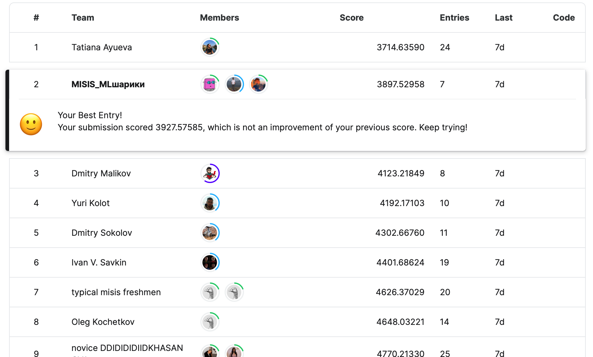
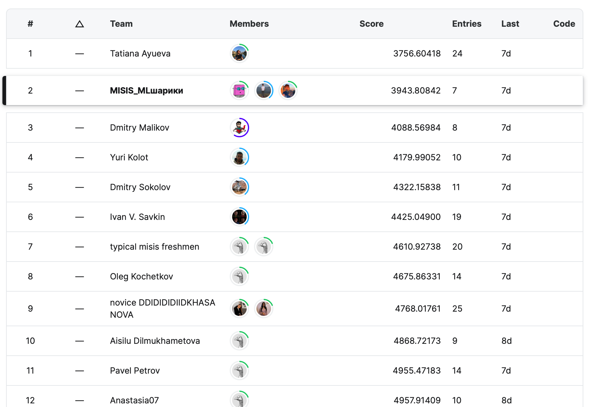
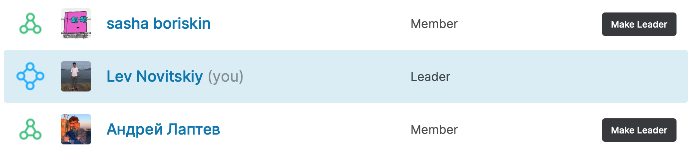

# RuCode-Payroll-2022
Our top 2 solution to [RuCode](https://rucode.net) 2022 AI [Payroll task](https://www.kaggle.com/competitions/vacancy-salary-prediction)


Public leaderboard                |  Private Leaderboard
:--------------------------------:|:-------------------------:
      |  


Our team: </br>


</br>
</br>
</br>
---
### Contest description:</br>
* Our task was to predict the salary for given vacanvies from [trudvsem.ru](https://trudvsem.ru) </br>
* The data was given as a .csv file with approx. 1kk samples in train.csv (71 columns) and 40k samples in test.csv (68 columns) (public - 40%, private - 60%) </br>
* The training data included categorical, binary, continous and text features </br>
* The target variable was ```mean_salary``` and additional targets were ```base_salary_max``` and ```base_salary_mean```</br>
* Many of the values were missed, e.g. in one of the features 95% were nan values </br>

### Solution desctiption: </br>
1. Fill in the misssing values
2. Generate new features
3. Select features
4. Target Transformation
5. Cross validate model
6. Stabilize the model


